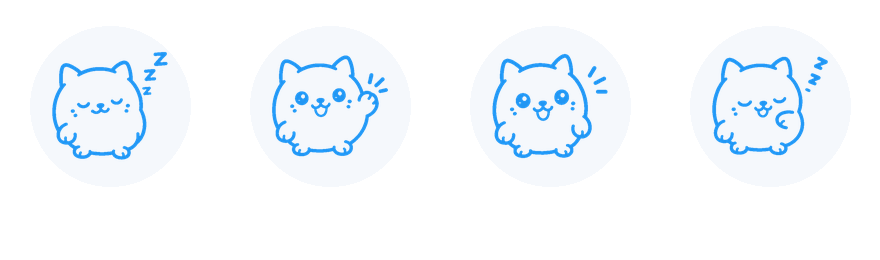

# FreedomCat

[](https://android-arsenal.com/api?level=21)
[](https://github.com/sstpnk/freedom-cat/releases)
[](https://www.gnu.org/licenses/gpl-3.0)

<p align="center">
  
</p>

**[🇷🇺 Русский](#русский)** | **[🇬🇧 English](#english)**

---

## Русский

### Что это такое

**FreedomCat** — это форк [NekoBox for Android](https://github.com/MatsuriDayo/NekoBoxForAndroid)
(в свою очередь форка [SagerNet](https://github.com/SagerNet/SagerNet)) — универсального
прокси-клиента для Android на базе [sing-box](https://github.com/SagerNet/sing-box).

Я просто взял проверенную годами кодовую базу NB4A и сделал из нее приложение под свои собственные потребности и ожидания:

- упростил интерфейс (группы и конфигурации подключений теперь на одном экране);
- добавил поддержку **AmneziaWG**, включая legacy-конфигурации и AmneziaWG 3.1 (см. ниже);
- удалил все, чем не пользуюсь.

### Возможности

- Работа через VPN-сервис (sing-box) с системным TUN;
- Сплит-туннелирование для приложений: можно гибко выбирать, какие приложения
  идут через VPN, а какие работают напрямую. Функция работает со всеми
  поддерживаемыми протоколами, включая WireGuard, legacy AmneziaWG и AmneziaWG 3.1;
- Управление конфигурациями: группы-карточки со свёртываемыми списками профилей;
- Импорт по ссылке/из буфера обмена/из файла/через QR-код;
- Импорт WireGuard/AmneziaWG-конфигураций из `.conf`, `.vpn`, `wireguard://`, `amneziawg://` и `vpn://`;
- Поддержка подписок (subscription) с обновлением по расписанию;
- Маршрутизация: собственные правила (маршруты), блокировка рекламы, блокировка QUIC;
- Режим VPN для приложений доступен непосредственно из меню;
- Статистика трафика, лог, тест задержек;
- Быстрое переключение сервера и группы.

### Поддержка WireGuard и AmneziaWG

**AmneziaWG** — это протокол на основе WireGuard с дополнительным шифрованием трафика,
который скрывает характер соединения от DPI и позволяет обходить глубокую фильтрацию
трафика. Протокол разработан проектом [AmneziaVPN](https://github.com/amnezia-vpn)
и совместим с серверами AmneziaVPN.

В этом форке поддержка AmneziaWG реализована следующим образом:

1. **sing-box**: в наш форк
   [sstpnk/sing-box](https://github.com/sstpnk/sing-box) (ветка `awg`) портирован
   эндпоинт AmneziaWG (`awg`) поверх [amneziawg-go](https://github.com/amnezia-vpn/amneziawg-go);
2. **libcore (gomobile)**: обновлённая библиотека подключает порт sing-box с AmneziaWG;
3. **Разбор конфигураций**: поддерживаются обычный WireGuard, legacy AmneziaWG
   (`Jc`, `Jmin`, `Jmax`, `S1`, `S2`, `H1`-`H4`) и AmneziaWG 3.1 с новыми
   параметрами endpoint;
4. **Импорт**: поддерживаются `.conf`, `.vpn`, `wireguard://`, `amneziawg://`
   и `vpn://`, включая экспорт из приложения Amnezia;
5. **Интерфейс**: AmneziaWG-профили корректно отображаются как `AmneziaWG`
   и доступны для ручного редактирования параметров.

Благодарим за наработки сообщество AmneziaVPN — без них сама идея бы не нашла воплощения.

### Список поддерживаемых протоколов

- SOCKS (4/4a/5)
- HTTP(S)
- SSH
- Shadowsocks
- VMess
- Trojan
- VLESS
- AnyTLS
- ShadowTLS
- TUIC
- Hysteria 1/2
- WireGuard
- **AmneziaWG**
- Trojan-Go (trojan-go-plugin)
- NaïveProxy (naive-plugin)
- Mieru (mieru-plugin)

### Форматы подписок

- Распространённые форматы (Shadowsocks, ClashMeta, v2rayN и т.п.)
- sing-box outbound

### Сборка из исходников

Требуется: JDK 17+, Android SDK (platform 35), Android NDK.

```bash
git clone --recurse-submodules https://github.com/sstpnk/freedom-cat.git
cd freedom-cat
./gradlew :app:assembleOssRelease
```

### Лицензия

Проект распространяется под лицензией [GPL-3.0](LICENSE).

### Благодарности

FreedomCat — это форк, поэтому в первую очередь мы благодарим авторов оригинальных
проектов:

**NekoBox for Android**

- [MatsuriDayo/NekoBoxForAndroid](https://github.com/MatsuriDayo/NekoBoxForAndroid)

**SagerNet**

- [SagerNet/SagerNet](https://github.com/SagerNet/SagerNet) и лично
  [nekohasekai](https://github.com/nekohasekai) — автор SagerNet / NB4A;

**sing-box / ядро**

- [SagerNet/sing-box](https://github.com/SagerNet/sing-box) — ядро, на котором всё работает;

**gomobile / инструменты сборки**

- [MatsuriDayo/gomobile](https://github.com/MatsuriDayo/gomobile) — сборка Go-ядра в AAR;

**Протокол AmneziaWG**

- [AmneziaVPN](https://github.com/amnezia-vpn) / [amneziawg-go](https://github.com/amnezia-vpn/amneziawg-go);

**Веб-панель**

- [Yacd-meta](https://github.com/MetaCubeX/Yacd-meta);

**Прочие вдохновляющие проекты**

- [shadowsocks/shadowsocks-android](https://github.com/shadowsocks/shadowsocks-android)

Полный список контрибьюторов оригинальных проектов можно посмотреть в их репозиториях:
[NekoBox for Android contributors](https://github.com/MatsuriDayo/NekoBoxForAndroid/graphs/contributors),
[SagerNet contributors](https://github.com/SagerNet/SagerNet/graphs/contributors).

---

## English

### What is this

**FreedomCat** is a fork of [NekoBox for Android](https://github.com/MatsuriDayo/NekoBoxForAndroid)
(which is itself a fork of [SagerNet](https://github.com/SagerNet/SagerNet)) — a universal
proxy client for Android built on top of [sing-box](https://github.com/SagerNet/sing-box).

I simply took the battle-tested NB4A codebase and made it an app tailored to my own
needs and expectations:

- simplified the UI (groups and connection configurations are now on a single screen);
- added **AmneziaWG** support, including legacy configs and AmneziaWG 3.1 (see below);
- removed everything I don't use.

### Features

- VPN service (sing-box) with system TUN;
- Per-app split tunneling: choose which apps go through VPN and which apps stay
  direct. This works with every supported protocol, including WireGuard, legacy
  AmneziaWG and AmneziaWG 3.1;
- Configuration management: group cards with collapsible profile lists;
- Import by link / from clipboard / from file / via QR code;
- WireGuard/AmneziaWG import from `.conf`, `.vpn`, `wireguard://`, `amneziawg://` and `vpn://`;
- Subscription support with scheduled updates;
- Routing: custom rules (routes), ad blocking, QUIC blocking;
- Apps VPN mode is available directly from the menu;
- Traffic statistics, log, latency testing;
- Fast server and group switching.

### WireGuard and AmneziaWG support

**AmneziaWG** is a WireGuard-based protocol with additional traffic encryption that
hides the connection signature from DPI and helps bypass deep traffic filtering.
The protocol was created by the [AmneziaVPN](https://github.com/amnezia-vpn) project
and is compatible with AmneziaVPN servers.

In this fork, AmneziaWG support is implemented as follows:

1. **sing-box**: our fork [sstpnk/sing-box](https://github.com/sstpnk/sing-box)
   (branch `awg`) includes the AmneziaWG (`awg`) endpoint built on top of
   [amneziawg-go](https://github.com/amnezia-vpn/amneziawg-go);
2. **libcore (gomobile)**: the updated library links the sing-box port with AmneziaWG;
3. **Config parsing**: plain WireGuard, legacy AmneziaWG (`Jc`, `Jmin`, `Jmax`,
   `S1`, `S2`, `H1`-`H4`) and AmneziaWG 3.1 endpoint parameters are supported;
4. **Import**: `.conf`, `.vpn`, `wireguard://`, `amneziawg://` and `vpn://`
   imports are supported, including exports from the Amnezia app;
5. **UI**: AmneziaWG profiles are shown as `AmneziaWG` and their connection
   parameters can be edited manually.

Thanks to the AmneziaVPN community for their work — without them this idea would
never have come to life.

### Supported proxy protocols

- SOCKS (4/4a/5)
- HTTP(S)
- SSH
- Shadowsocks
- VMess
- Trojan
- VLESS
- AnyTLS
- ShadowTLS
- TUIC
- Hysteria 1/2
- WireGuard
- **AmneziaWG**
- Trojan-Go (trojan-go-plugin)
- NaïveProxy (naive-plugin)
- Mieru (mieru-plugin)

### Supported subscription formats

- Widely used formats (like Shadowsocks, ClashMeta and v2rayN)
- sing-box outbound

### Building from source

Requirements: JDK 17+, Android SDK (platform 35), Android NDK.

```bash
git clone --recurse-submodules https://github.com/sstpnk/freedom-cat.git
cd freedom-cat
./gradlew :app:assembleOssRelease
```

### License

The project is distributed under the [GPL-3.0](LICENSE) license.

### Credits

FreedomCat is a fork, so first of all I would like to thank the authors of the
original projects:

**NekoBox for Android**

- [MatsuriDayo/NekoBoxForAndroid](https://github.com/MatsuriDayo/NekoBoxForAndroid)

**SagerNet**

- [SagerNet/SagerNet](https://github.com/SagerNet/SagerNet) and personally
  [nekohasekai](https://github.com/nekohasekai) — author of SagerNet / NB4A;

**sing-box / core**

- [SagerNet/sing-box](https://github.com/SagerNet/sing-box) — the core everything runs on;

**gomobile / build tooling**

- [MatsuriDayo/gomobile](https://github.com/MatsuriDayo/gomobile) — builds the Go core into an AAR;

**AmneziaWG protocol**

- [AmneziaVPN](https://github.com/amnezia-vpn) / [amneziawg-go](https://github.com/amnezia-vpn/amneziawg-go);

**Web dashboard**

- [Yacd-meta](https://github.com/MetaCubeX/Yacd-meta);

**Other inspiring projects**

- [shadowsocks/shadowsocks-android](https://github.com/shadowsocks/shadowsocks-android)

Full contributor lists of the original projects can be found in their repositories:
[NekoBox for Android contributors](https://github.com/MatsuriDayo/NekoBoxForAndroid/graphs/contributors),
[SagerNet contributors](https://github.com/SagerNet/SagerNet/graphs/contributors).
